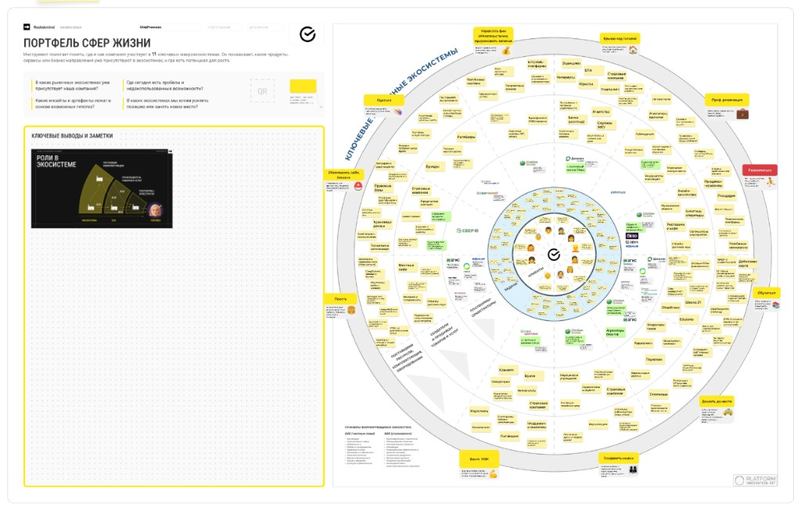

# Портфель сфер жизни: схема экосистемы («ромашка»)

**Назначение:** ориентир для **product discovery** внутри портфеля макро-экосистем. Прогоните свой продукт или гипотезу по «лепесткам»: где логична точка входа, **кто может быть ЛПР**, с кем имеет смысл провести интервью или пилот в B2B-цепочке.

---

## Как использовать за 15 минут

1. **Выберите 1–2 лепестка**, куда по смыслу попадает ценность продукта (не «везде сразу»).
2. Для каждого лепестка запишите: **задача клиента** (JTBD), **кто принимает решение** (роль / уровень), **какие сервисы уже закрывают спрос** (прямые и косвенные альтернативы).
3. Отметьте **пробелы**: где экосистема не закрывает потребность или закрывает плохо — там гипотеза для углубления.
4. Для B2B: пройдите цепочку **заказчик → бюджет → эксплуатация** и решите, кого спрашивать первым (часто это не тот, кто «первая линия» в CRM).

**Вопросы с холста (discovery):**

- В каких макро-экосистемах компания уже представлена?
- Где сегодня пробелы и недоиспользованные возможности?
- Какие инсайты и артефакты лежат в основе возможных гипотез?
- В каких экосистемах хотим усилить позицию или занять новое место?

---

## Структура круга (от центра к периферии)

| Слой | Смысл |
|------|--------|
| **Клиенты** | Для кого создаётся ценность (иконки людей в центре). |
| **Задачи** | Конкретные JTBD по сектору — что человек или бизнес хочет получить. |
| **Платформы-оркестраторы** | Цифровые слои, которые связывают клиента с решением (например, единый ID, платёж, вход в сервисы). |
| **Создатели и продавцы товаров и услуг** | Продуктовые бренды и сервисы на периферии круга. |
| **Поставщики ресурсов, комплектующих, оборудования** | Инфраструктурный контур под продуктами. |

---

## Одиннадцать макро-экосистем (лепестки)

Кратко: **название смысла** — что внутри, примеры брендов с холста (если есть).

1. **Управлять финансовыми обязательствами, приумножать капитал** — банкинг, инвестиции, страхование, налоги, нотариат и смежные сервисы.
2. **Крыша над головой** — ипотека, сделки, стройка, управление недвижимостью. *Примеры:* Домклик.
3. **Профессиональная реализация** — карьера, поиск работы, инструменты для бизнеса, рекрутинг.
4. **Развлекаться** — медиа, кино, музыка, игры, события. *Примеры:* Okko, СберЗвук.
5. **Обучаться** — школы, онлайн-образование, переквалификация. *Примеры:* Школа 21, Edutoria.
6. **Доехать — довезти** — транспорт, логистика, каршеринг, автосервисы. *Пример:* Ситидрайв.
7. **Сохранять жильё** — ЖКХ, ремонт, умный дом, клининг.
8. **Вести ЗОЖ** — спорт, фитнес, wellness.
9. **Поесть** — доставка еды, рестораны, продукты, кейтеринг. *Примеры:* СберМаркет, Самокат, Delivery Club.
10. **Обеспечить себя и близких** — безопасность, забота о семье, базовые потребности.
11. **Одеться** — мода, ритейл, сервисы вокруг одежды.

*(Точные формулировки на жёлтых ярлыках смотрите на изображении выше.)*

---

## Роли в экосистеме (врезка на схеме)

- **B2C** — ожидания частных клиентов: безопасность, здоровье, коммуникации, самореализация, комфорт, экономия времени и денег.
- **B2B** — ожидания юрлиц: оптимизация затрат, рост продаж, инновации, управление рисками, масштабирование, операционная эффективность.
- **Человек в контуре** — поставщик компетенций; пользователь; партнёр / инвестор.

**Практический вывод:** в каждом лепестке уточняйте, вы продаёте в **B2C**, **B2B** или в **гибрид** (частный пользователь инициирует, бюджет у компании).

---

## Key findings (заполнить под свой кейс)

- Наш продукт попадает в лепесток(и): **___**
- Гипотеза ценности в одном предложении: **___**
- Кто ЛПР / спонсор бюджета: **___**
- С кем поговорить в первую очередь (3 имени/роли): **___**
- Главный риск (регуляторика, канал, конкурент): **___**

---

*Источник визуала: рабочий холст «Портфель сфер жизни»; файл картинки в репозитории: `lecture_assets/sber-ecosystem-daisy.png`.*
